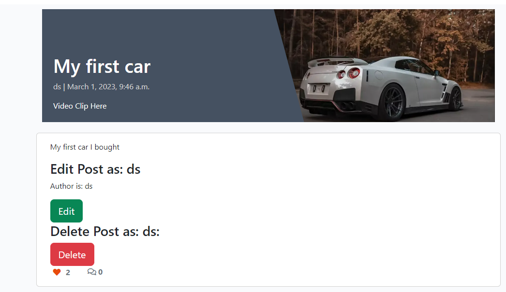

Welcome 

This is the Code Institute student PP4 readme for the project deployed to [https://ib-the-garage-pp4.herokuapp.com/](https://ib-the-garage-pp4.herokuapp.com/)

Note: To open any links in this README in a new browser tab, press CTRL + Click or right click and open in new tab/window.

# The Garage

### By [Ian Bowell](https://www.instagram.com/skianianiam/)

## **[Live site](https://ib-the-garage-pp4.herokuapp.com/)**

> Responsive Examples of Live Site


 - The site is fully responsive across multiple screen sizes and devices. 
 - I had to make significant security research, updates and testing to get this test to work.
 - Most people simply removed x-frame checks with a Chrome addin. 
 - I did not think this a full solution so I implemented the following line in base.html
 - `<meta http-equiv="Content-Security-Policy"...` , listing the sites that
 - are allowed to embed my site in theirs, with success above. 
 - This is a more informative and professionally production ready approach.

---

## **[Repository](https://github.com/ian-IBCIRL/IB-PP4-MVP/)**

## Introduction
The Garage is a website built in Django using Python, JavaScript, CSS and HTML. 
It enables users to create and share vehicle posts with other users from around the world. 
It is targeted towards users who enjoy their vehicles and would like to share their vehicle posts with others. 
I have explicitly and intentionally not limited the site to just cars, hence allowing any vehicle. 
Posts are admin moderated and will be deleted if inappropriate.
At the moment, users can publish their posts, although they may be allowed moderated draft posts in future, if irrelevant or inappropriate content is posted.

Users have the ability to create, update, read and delete their own vehicle posts.
They can upload vehicle images for their vehicle post, link YouTube videos of their vehicle and websites. 
They can also like and unlike other users vehicle posts.

---


This is my fourth project for the Code Institute Diploma in Software Development (E-commerce Applications).

The site provides role based permissions for users to interact with an SQL database. 

The site includes user authentication and Full CRUD functionality for Vehicle posts.

In future, I may add tables for components, stories, email verification and social media login.
In future I may add user profiles, and the ability to update and delete their own user profile, and associated posts. 


[View the live website on Heroku](https://ib-the-garage-pp4.herokuapp.com/)

Note: To open any links in this README in a new browser tab, press CTRL + Click.

## Table of Contents
* [Features](#features)
* [Future Enhancements](#future-enhancements)
* [Technologies Used](#technologies-used)
* [Agile Development](#agile)
* [Testing](#testing)
* [User Experience Design (UX)](#ux)
* [Deployment](#deployment)
* [Release History](#release-history)
* [Credits](#credits)
* [Reminders](#reminders)


## Features
* [Back to table of contents](#table-of-contents) 
* [Back to top of README.md](#the-garage) 

#### Home page
A homepage was built to welcome the user to the site and clearly convey the site’s purpose with some interesting initial posts.

Public domain images were found on https://www.pexels.com/search/car%20webp/

#### User Features (with notification messages):

 - **Users can** create an account with their username, password and e-mail (**Create**)
 - **Users can** log into their account
 - **Users can** log out of their account
 - **Users can** make a vehicle post through the post vehicle form **(Create)**
 - **Users can** view their posts from post list page (**Read**)
 - **Users can** edit their post and change the image or any other information they have on their post (**Update**)
 - **Users can** delete posts from the detail page (**Delete**)

#### Account restrictions:
 - **Users cannot** access the edit section of an post without being logged in
 - **Users cannot** access the add post form until they sign up or login
 - **Users cannot** edit their UserID as it is a primary key
 - **Users cannot** edit other users posts
 - **Users cannot** access the admin panel of the website unless they have admin status

#### Deleting posts
Got post deletion working, and have added "Are you sure?" logic"

Thanks to this post https://stackoverflow.com/questions/51781841/delete-a-post-in-django 

Have since got this working with class based views/functions for CRUD.

### index.html

#### Desktop website

> Desktop Nav Bar


 - The desktop nav bar consists of a Home, Register and Login menu items. 
 - If the user is not logged in they have the option to Register or Login.

> Logged in Nav Bar


 - If the user is logged in they have the option to Create a post via the Vehicles dropdown menu.

> Dropdown Nav Bar


 - The List option is just a way to go back to the home page at this time.
 - I may add Search option here in due course.

 - If the user is logged in they have the option to logout.

 - If the user is a superuser they could then also have access to the django admin panel through the link beside logout. 

> Admin Dropdown Nav Bar


---

### post_detail.html

#### Desktop website

> Post detail


> Create detail


 - If the user is logged in they have the option to logout.
 - If the user is logged in and the author of the post they have the option to Edit or Delete the post.

> Edit or Delete detail



> Delete check detail


 - If the user is logged in they have the option to comment on the post and get a notice that it is awaiting admin approval. They can also like or unlike posts.

> Comment detail


> Comment Approval notice detail


 - If the admin user is logged in they have the option to approve the comment on the post.

> Comment Approval detail


> Comment Approval Result


---


------

## Future Enhancments
There are a few enhancements to functionality that I would like to add in the future. 

The key enhancements I would like to add to the site in the future are:
* The ability for users to message other users
* The ability for users to login via social networks such as google or facebook
* The ability for users to book service appointments with an experienced local mechanic at better rates than dealers
* In future, I may add SQL tables with models and classes for vehicle components, stories, email verification and social media login.
* In future I may add also user profiles, and the ability to update and delete their own user profile. 

Some of the functionality above is provided by allauth which is already installed into the site.
So it only has to be setup in order for it to function. 
Other featuers would need to be developed from scratch.

I have left the original user stories that were developed in the project Kanban board as future enhancement opportunities.

## Technologies Used
* [Back to table of contents](#table-of-contents) 
* [Back to top of README.md](#the-garage) 

* Python
    * The following python modules were used on this project:
```
asgiref==3.6.0
cloudinary==1.30.0
dj-database-url==0.5.0
dj3-cloudinary-storage==0.0.6
Django==3.2.16
django-allauth==0.52.0
django-crispy-forms==1.14.0
django-heroku==0.3.1
django-summernote==0.8.20.0
gunicorn==20.1.0
oauthlib==3.2.2
psycopg2==2.9.5
PyJWT==2.6.0
python3-openid==3.2.0
pytz==2022.7
requests-oauthlib==1.3.1
sqlparse==0.4.3
whitenoise==6.2.0
```
* Django
    * Django was used as the main python framework in the development of this project
    * Django AllAuth was utilised to provide enhanced user account management functionality.
* Heroku
    * Was used as the cloud based platform to deploy the site to https://ib-the-garage-pp4.herokuapp.com/
* ElephantSQL PostgreSQL
    * ElephantSQL PostgreSQL was used as the database for this project during development and in production.
* Cloudinary Storage
    * Cloudinary Storage was used as the cloud storage of images and icons for this project during development and in production. Had to also use this for favicon.ico instead of static data when deployed to Heroku.
* JavaScript
    * Custom JavaScript was utilised to enable .
* Bootstrap 5.13
    * Bootstrap was used for general layout and spacing requirements for the site.
* Font Awesome
    * Was used for access to several icons for different sections where icons were appropriate.
* CSS
    * Custom css was written for a large number of areas on the site to implement custom styling.
* HTML
    * HTML was used as the base language for the templates created for the site.

#### Packages Used

* VS Code was used to develop the site
* Git was utilised for version control and transferring files between the code editor and the repository
* GitHub was utilised for storing the files for this project

* [Back to table of contents](#table-of-contents) 
* [Back to top of README.md](#the-garage) 

## Agile Development

<a name="agile"></a>

### Agile Overview
* [Back to table of contents](#table-of-contents) 
* [Back to top of README.md](#the-garage) 


This project was started with my GitHub Projects [Page](https://github.com/users/ian-IBCIRL/projects/4) to track and manage the expected epics, user stories, milestones and other work and sprints involved.
The purpose of Agile Development is to plan and measure progress for expected work and tasks, by listing the epics and then break them down into user stories or smaller tasks to ultimately finish the site in the allocated time.

To see my Kanban board in the project, click [here](https://github.com/users/ian-IBCIRL/projects/4).

At the initial stages I decided on core requirements ('must have' issues) for the project and some 'could have' issues but not critical requirements.

From these I added the associated Epics, user stories, acceptance criteria and the tasks so I can track my work effectively.
I did also use [milestones](https://github.com/ian-IBCIRL/IB-PP4-MVP/milestones) as another way to visualise Epic completion status.

Once I completed a task I note the item as completed and if all parts of this story were completed I would move it from **In Progress** to **Done** on the Kanban board. Acceptance criteria would also be noted where appropriate.

At the end of a coding session I would update the user stories with a comment of:

 - What was done
 - What is left to be done
 - Reminders to track where I finished so subsequent work would follow.

#### Epics

##### Completed Epics

1. [EPIC: setup django and deploy the site](https://github.com/ian-IBCIRL/IB-PP4-MVP/issues/1)
2. [EPIC: view and open posts](https://github.com/ian-IBCIRL/IB-PP4-MVP/issues/3)
3. [EPIC: See and add/remove likes and see and add comments](https://github.com/ian-IBCIRL/IB-PP4-MVP/issues/15)
4. [EPIC: Admin can manage posts](https://github.com/ian-IBCIRL/IB-PP4-MVP/issues/16)
5. [EPIC: User sign up, login and CRUD posts](https://github.com/ian-IBCIRL/IB-PP4-MVP/issues/17)
6. [EPIC: Testing](https://github.com/ian-IBCIRL/IB-PP4-MVP/issues/22)

#### User stories

#####  Completed User Stories

To view details of the user stories please click on a user story below.
See the project page for the full [list of issues](https://github.com/ian-IBCIRL/IB-PP4-MVP/issues?q=is%3Aissue) to see the details and comments.
See the Kanban page [here](https://github.com/users/ian-IBCIRL/projects/4/views/1)

 1. [USER STORY: Deploy Website](https://github.com/ian-IBCIRL/IB-PP4-MVP/issues/2)
 2. [USER STORY: View Post List](https://github.com/ian-IBCIRL/IB-PP4-MVP/issues/4)
 3. [USER STORY: Open a Post](https://github.com/ian-IBCIRL/IB-PP4-MVP/issues/5)
 4. [USER STORY: Account Registration](https://github.com/ian-IBCIRL/IB-PP4-MVP/issues/8)
 5. [USER STORY: Comment on a Post](https://github.com/ian-IBCIRL/IB-PP4-MVP/issues/9)
 6. [USER STORY: Edit My Posts Only](https://github.com/ian-IBCIRL/IB-PP4-MVP/issues/19)
 7. [USER STORY: Like / Unlike posts](https://github.com/ian-IBCIRL/IB-PP4-MVP/issues/10)
 8. [USER STORY: Delete Posts (CRUD)](https://github.com/ian-IBCIRL/IB-PP4-MVP/issues/9)
 9. [USER STORY: Testing](https://github.com/ian-IBCIRL/IB-PP4-MVP/issues/23)

The following User stories were not completed as they are possible future features:

 ##### Future Feature User stories
 
 1. [USER STORY: Garage Service Bookings](https://github.com/ian-IBCIRL/IB-PP4-MVP/issues/24)
 2. [USER STORY: Social Login](https://github.com/ian-IBCIRL/IB-PP4-MVP/issues/14)
 
I decided against implementing some future features at this time due to deadlines and because the core requirements of the project have been satisfied elsewhere.

---

## Testing
* [Back to table of contents](#table-of-contents) 
* [Back to top of README.md](#the-garage) 

Testing was divided into different sections to ensure everything was tested individually with test cases developed for each area.

[Testing Schedule Overview](/assets/testing/test-schedule.pdf)

Details of the [testing](/assets/testing/TESTING.md) procedures and methodology can be found in the testing.md file [here](/assets/testing/TESTING.md)

The site was also tested for responsiveness here https://www.browserstack.com/responsive and here https://ui.dev/amiresponsive


> Responsive Examples of Live Site


 - The site is fully responsive across multiple screen sizes and devices. 
 - I had to make significant security research, updates and testing to get this test to work.
 - Most people simply removed x-frame checks with a Chrome addin. 
 - I did not think this a full solution so I implemented the following line in base.html
 - `<meta http-equiv="Content-Security-Policy"...` , listing the sites that
 - are allowed to embed my site in theirs, with success above. 
 - This is a more informative and professionally production ready approach.


### Bugs of note

It is difficult to enforce input validation to image file types. 
Enforcing the file types within the cloudinary documentation was not found. 
This enabled users to upload non-image file types. 
To address this issue, within the view that handles the form submission, I may try a try, except statement that attempts to upload the file. If the upload fails due to the file type error on the cloudinary servers, it handles the error and provides the user with an error message informing them what happened and why. 
This prevents users from breaking the functionality of the site, whilst still enabling them to correct the file they are trying to upload.

### Development bugs: 

#### fixed 

user.username to author comparison did not work with user.username == post.author so found i had to compare user == post.author not user.username.

Thanks to this post
https://stackoverflow.com/questions/43879330/djangounable-to-compare-the-logged-in-user-with-the-author-of-the-post 

No other bugs of note were found during development of the site. 

Several minor bugs were encountered due to small logic mistakes or unexpected scenarios.

For example, I was missing enctype="multipart/form-data" in my form attributes for creating a post.
So the form was not uploading the image selected by the user.
Once that was in, all is well, and my users are no longer seeing placeholders.

These were found during the several rounds of testing and corrected. 

There are no known bugs left in the site.


## UX
* [Back to table of contents](#table-of-contents) 
* [Back to top of README.md](#the-garage) 

*  The Garage is intended to be a friendly community site for users to create and share their own cars with others. Users will also be able to find cars created by other users from around the world. The graphical elements and overall design of the site provide the user with a fun and enjoyable environment.

A [Full detailed breakdown](/assets/docs/UX.md) of the [UX and wireframes](/assets/docs/UX.md) methodology can be found in the UX.md file [here](/assets/docs/UX.md)

[Wireframes are here!](/assets/docs/UX.md)

## Deployment
* [Back to table of contents](#table-of-contents) 
* [Back to top of README.md](#the-garage) 

The site was deployed via Heroku, and the live link can be found here - [The Garage](https://ib-the-garage-pp4.herokuapp.com/)

### Project Deployment

To deploy the project through Heroku I followed these steps:
* Sign up / Log in to [Heroku](https://www.heroku.com/)
* From the main Heroku Dashboard page select 'New' and then 'Create New App'
* Give the project a name - I used ib-the-garage-pp4 and select a suitable region, then select create app. The name for the app must be unique.
* This will create the app within Heroku and bring you to the deploy tab. From the submenu at the top, navigate to the resources tab.
* Add the database to the app, in the add-ons section search for 'Heroku Postgres', select the package that appears and add 'Heroku Postgres' as the database
* Navigate to the setting tab, within the config vars section copy the DATABASE_URL to the clipboard for use in the Django configuration.
* Within the django app repository create a new file called env.py for local use (not needed in Heroku) - within this file import the os library and set the environment variable for the DATABASE_URL pasting in the address copied from Heroku. The line should appear as os.environ["DATABASE_URL"]= "Paste the Elephant SQL link in here"
* Add a secret key to the app using os.environ["SECRET_KEY"] = "your secret key goes here"
* Add the secret key just created to the Heroku Config Vars as SECRET_KEY for the KEY value and the secret key value you created as the VALUE
* In the settings.py file within the django app, import Path from pathlib, import os and import dj_database_url
* insert the line if os.path.isfile("env.py"): import env
* remove the insecure secret key that django has in the settings file by default and replace it with SECRET_KEY = os.environ.get('SECRET_KEY')
* replace the databases section with DATABASES = { 'default': dj_database_url.parse(os.environ.get("DATABASE_URL"))} ensure the correct indentation for python is used.
* In the terminal migrate the models over to the new database connection
* Navigate in a browser to cloudinary, log in, or create an account and log in. 
* From the dashboard - copy the CLOUDINARY_URL to the clipboard
* in the env.py file (or Heroku config) created earlier - add os.environ["CLOUDINARY_URL"] = "paste in the Url copied to the clipboard here"
* In Heroku, add the CLOUDINARY_URL and value copied to the clipboard to the config vars
* Also add the KEY - DISABLE_COLLECTSTATIC with the Value - 1 to the config vars
* this key value pair must be removed prior to final deployment
* Add the cloudinary libraries to the list of installed apps, the order they are inserted is important, 'cloudinary_storage' goes above 'django.contrib.staitcfiles' and 'cloudinary' goes below it.
* in the Settings.py file - add the STATIC files settings - the url, storage path, directory path, root path, media url and default file storage path.
* Link the file to the templates directory in Heroku TEMPLATES_DIR = os.path.join(BASE_DIR, 'templates')
* Change the templates directory to TEMPLATES_DIR - 'DIRS': [TEMPLATES_DIR]
* Add Heroku to the ALLOWED_HOSTS list the format will be the app name given in Heroku when creating the app followed by .herokuapp.com
* In your code editor, create three new top level folders, media, static, templates
* Create a new file on the top level directory - Procfile
* Within the Procfile add the code - web: guincorn PROJECT_NAME.wsgi
* In the terminal, add the changed files, commit and push to GitHub
* In Heroku, navigate to the deployment tab and deploy the branch manually - watch the build logs for any errors.
* Heroku will now build the app for you. Once it has completed the build process you will see a 'Your App Was Successfully Deployed' message and a link to the app to visit the live site.

#### Forking the repository
By forking the GitHub Repository you can make a copy of the original repository to view or change without it effecting the original repository
This can be done by
    * Log into GitHub or create an account.
    * Locate the repository at https://github.com/Ian-IBCIRL/IB-PP4-MVP.
    * At the top of the repository, on the right side of the page, select "Fork" from the buttons available.
    * A copy of the repository should now be created in your own repository.

#### Create a clone of this repository
Creating a clone enables you to make a copy of the repository at that point in time - this lets you run a copy of the project locally:
This can be done by:
* Navigate to https://github.com/Ian-IBCIRL/IB-PP4-MVP
* click on the arrow on the green code button at the top of the list of files
* select the clone by https option and copy the URL it provides to the clipboard
* navigate to your code editor of choice and within the terminal change the directory to the location you want to clone the repository to.
* type 'git clone' and paste the https link you copied from github
* press enter and git will clone the repository to your local machine

### Acknowledgements

I'd like to thank the following:
* Ronan McClelland for all help during this project.
* All at CI for their help and steering me in the right direction.


## Release History
* [Back to table of contents](#table-of-contents) 
* [Back to top of README.md](#the-garage) 

We continually tweak and adjust this.

Here is the version history:

**Jan 1 2023:** Begin MVP planning.

**Jan 23 2023:** Successful initial heroku deployment.

**Feb 03 2023:** Successful initial post deletion logic. Needs more checks and post editing/adding.

**Mar 09 2023:** Successful deployment of submission features.

------


## Credits
* [Back to table of contents](#table-of-contents) 
* [Back to top of README.md](#the-garage) 


-   ### Source code

    - Code Institute Django course material, tutors, mentors and colleagues in Slack channels.
    - Bootstrap documentation https://getbootstrap.com/docs/5.3/getting-started/introduction/ 
    
-   ### Images
    - Car images https://www.pexels.com/ 
    - favicon.ico generation https://favicon.io/favicon-generator/
    - Colors from [Lilybug Design](https://www.lilybugdesign.co.nz/procreate-color-palettes)


## Reminders
* [Back to table of contents](#table-of-contents) 
* [Back to top of README.md](#the-garage) 

To install django, `pip3 install 'django<4' gunicorn`

and `pip3 install dj_database_url==0.5.0 psycopg2`
and `pip3 install dj3-cloudinary-storage`

To create the essential manage.py file and the key step in enabling the site to launch
use `django-admin startproject "put your appname here" .` don't forget the DOT at the end !!
We used driverblog for our blog about cars and other vehicles.
Don't forget the DOT at the end as this tells Django admin that we want to create our project in the current top level folder

Then use `python3 manage.py startapp vehicles` for example, to create the vehicles app within the driverblog project
And we update `settings.py` with details for the apps, hosts and secrets etc.

Use `python3 manage.py runserver` to launch web server

```
python3 manage.py runserver
```

We add the app with `python3 manage.py startapp blog` for example

Then we need to migrate the changes to the database etc with `python3 manage.py migrate`

Remember to update settings.py with all the env vars for secure access to Django and the Elephant DB in the database section

```
import os
import dj_database_url
if os.path.isfile('env.py'):
import env
```

To set up a app/database admin we need `python3 manage.py createsuperuser`

To install the app in Heroku you need:

1) Environment variables from env.py in your Heroku app settings
2) A Procfile to run the webserver i.e. `web: gunicorn driverblog.wsgi` 
    
    in this case to run my driverblog app on the gunicorn wsgi webserver.

Remember also to `python manage.py collectstatic`

The project can now be deployed to Heroku at the website configured above.

To log into the Heroku toolbelt CLI:

1. Log in to your Heroku account and go to *Account Settings* in the menu under your avatar.
2. Scroll down to the *API Key* and click *Reveal*
3. Copy the key
4. In Gitpod, from the terminal, run `heroku_config`
5. Paste in your API key when asked

You can now use the `heroku` CLI program - try running `heroku apps` to confirm it works. This API key is unique and private to you so do not share it. If you accidentally make it public then you can create a new one with _Regenerate API Key_.


**Anything more?**

Yes! We'd strongly encourage you to look at the source code!

---

Happy coding!
* [Back to table of contents](#table-of-contents) 
* [Back to top of README.md](#the-garage) 

